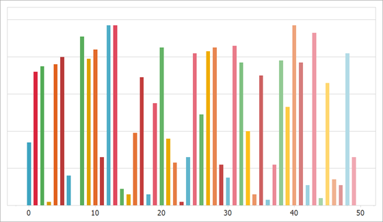

<!-- default badges list -->

<!-- default badges end -->

# Chart for WinForms - Bind a Series to Data

This example shows how to bind an individual series to data at runtime.

Although this example binds the series to a [DataTable](https://docs.microsoft.com/en-us/dotnet/api/system.data.datatable?view=net-6.0), you can use the following properties to bind the series to any source:

* [Series.DataSource](https://docs.devexpress.com/CoreLibraries/DevExpress.XtraCharts.Series.DataSource?p=netframework)
* [SeriesBase.ArgumentDataMember](https://docs.devexpress.com/CoreLibraries/DevExpress.XtraCharts.SeriesBase.ArgumentDataMember?p=netframework)
* [Series.ValueDataMembers](https://docs.devexpress.com/CoreLibraries/DevExpress.XtraCharts.SeriesBase.ValueDataMembers?p=netframework)

## Files to Look At

* [Form1.cs](./CS/Form1.cs) (VB: [Form1.vb](./VB/Form1.vb))

## Documentation 

* [How to: Bind Individual Chart Series to Data (Runtime Sample)](https://docs.devexpress.com/WindowsForms/3095/controls-and-libraries/chart-control/examples/creating-charts/providing-data/how-to-bind-individual-chart-series-to-data-runtime-sample?p=netframework)
* [Provide Data](https://docs.devexpress.com/WindowsForms/5774/controls-and-libraries/chart-control/providing-data)

## More Examples

* [How to programmatically bind series to data and display them in separate panes](https://github.com/DevExpress-Examples/how-to-programmatically-bind-series-to-data-and-display-them-in-separate-panes-e431)
* [How to programmatically display automatically created series in separate panes](https://github.com/DevExpress-Examples/how-to-programmatically-display-automatically-created-series-in-separate-panes-e433)
* [How to bind a chart to XPO](https://github.com/DevExpress-Examples/how-to-bind-a-chart-to-xpo-e1576)
* [How to bind a chart to an XML data source](https://github.com/DevExpress-Examples/how-to-bind-a-chart-to-an-xml-data-source-e1583)
* [How to bind a chart to an MDB database at runtime](https://github.com/DevExpress-Examples/how-to-bind-a-chart-to-an-mdb-database-at-runtime-e1617)
* [How to bind a chart to an ArrayList data source](https://github.com/DevExpress-Examples/how-to-bind-a-chart-to-an-arraylist-data-source-e2080)
* [How to Simultaneously configure settings for template series and series added to the chart manually](https://github.com/DevExpress-Examples/winforms-charts-configure-settings-for-template-series-and-series-added-manually)
* [How to use the existing ChartControl as a source for an XRChart](https://github.com/DevExpress-Examples/how-to-use-the-existing-chartcontrol-as-a-source-for-an-xrchart-e1165)
<!-- feedback -->
## Does this example address your development requirements/objectives?

 

(you will be redirected to DevExpress.com to submit your response)
<!-- feedback end -->
